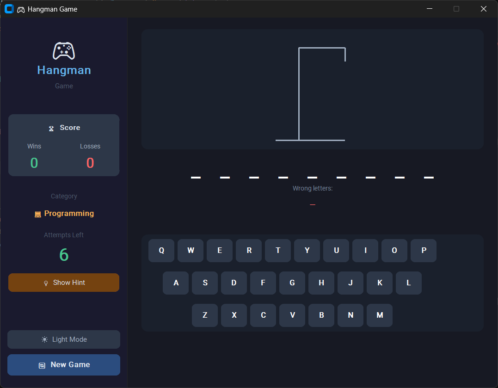
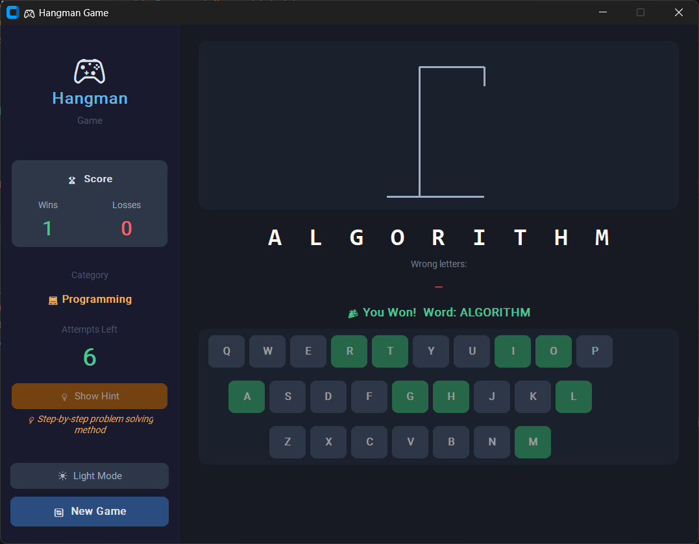
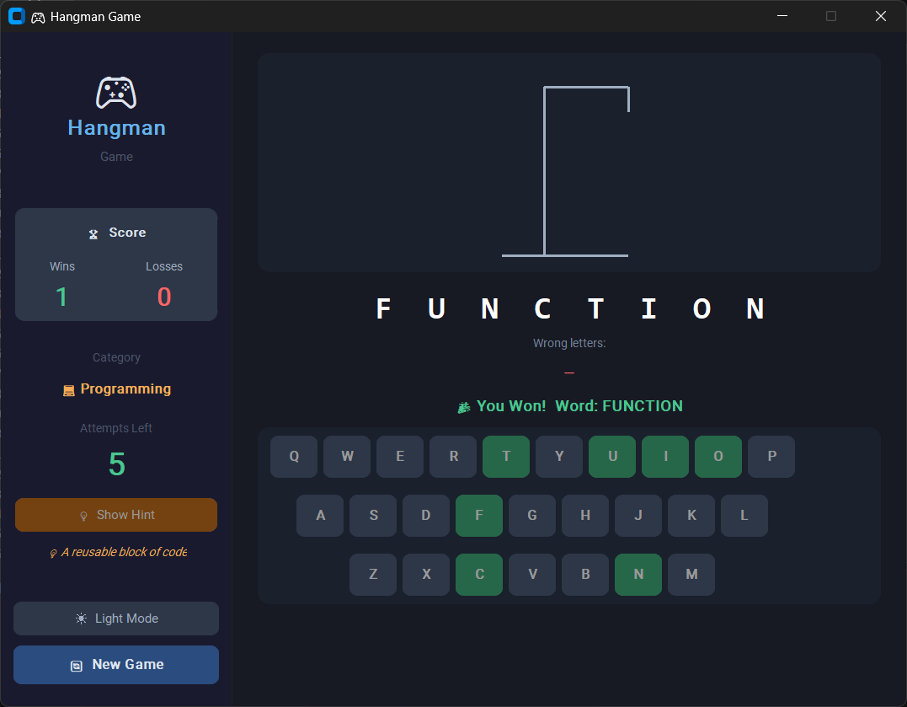
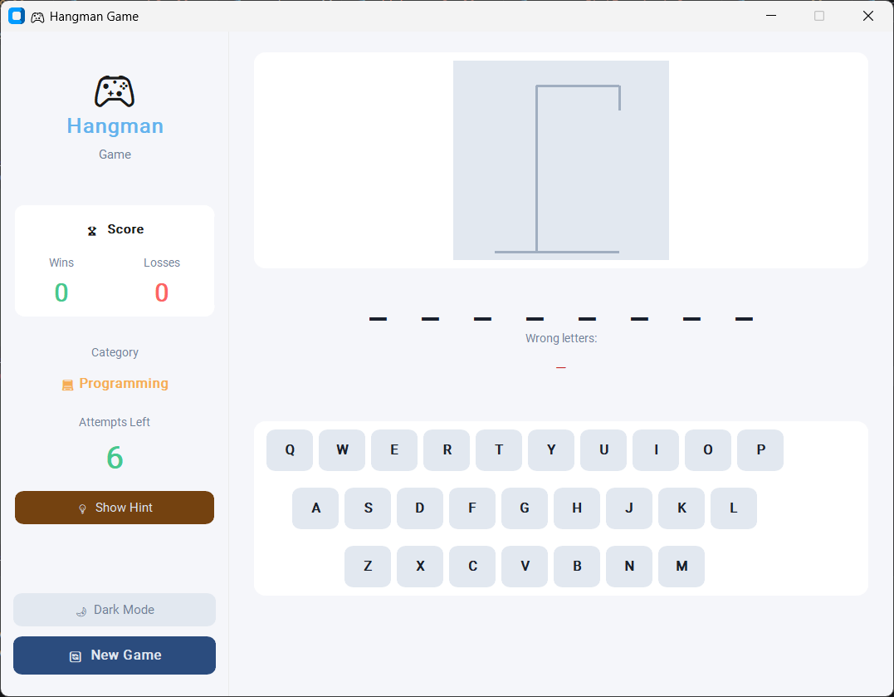

# 🎮 Hangman-Game-GUI 🔤

A modern, feature-rich desktop Hangman game built with **CustomTkinter**.
It offers a sleek user interface with sidebar navigation, an on-screen keyboard, animated hangman drawing, multiple word categories, a hint system, and a live score tracker for a complete gaming experience.

---

## 🧱 Project Structure

```bash
Hangman-Game-GUI/
│
├── main.py                  # Application entry point
├── requirements.txt         # Python dependencies
├── assets/                  # Images and assets for the GUI
├── core/                    # Game logic modules
│   ├──__init__.py
│   └── game.py              # Hangman game mechanics
├── data/                    # Game data
│   ├──__init__.py
│   └── words.py             # Word lists for categories
├── gui/                     # User interface components
│   ├── __init__.py
│   ├── app.py
│   ├── canvas.py
│   └── sidebar.py           # Sidebar navigation UI
└── README.md                # Project documentation
```

---

## ✨ Features

### 🎮 Gameplay
- **Classic Hangman rules** – guess letters to uncover a hidden word before the hangman is fully drawn
- **4 distinct word categories – choose from different themes for varied gameplay
- **On-screen A-Z keyboard** – fully interactive with visual feedback
- **Hint system** – get clues when you're stuck
- **Live score tracker** – keep track of your wins and losses

### 🖥 GUI Highlights
- Modern, dark-themed interface using **CustomTkinter**
- **Sidebar dashboard** – live score, current category, attempts left, and hint button
- **Animated hangman drawing** – each wrong guess adds a part of the hangman
- **Dark & Light mode** – toggle instantly from the sidebar, every panel/card/button re-themes
- Responsive layout with clear visual feedback for correct/wrong guesses

---

## 🛠 Technologies Used

| Technology | Role |
| ---------- | ---- |
| **Python 3** | Core programming language |
| **CustomTkinter** | Modern GUI framework |
| **Random** | Word selection and game variation |
| **Tkinter** | Base UI components |

---

## ▶️ How to Run

**1. Clone the repository:**

```bash
git clone https://github.com/ShakalBhau0001/Hangman-Game-GUI.git
```

**2. Enter the project folder:**

```bash
cd Hangman-Game-GUI
```

**3. Install dependencies:**

```bash
pip install -r requirements.txt
```

**OR**

```bash
pip install customtkinter
```

**4. Run the game:**

```bash
python main.py
```

---

## 🎯 How to Play

1. **Select a category** – choose from the sidebar: Animals, Countries, Movies, or Technology
2. **Start guessing** – click on letters from the on-screen keyboard or use your physical keyboard
3. **Use hints** – click the hint button if you need a clue
4. **Win or lose** – guess all letters correctly to win; each wrong guess adds a part to the hangman
5. **Track your score** – your wins and losses are displayed in real-time
6. **Play again** – start a new game with the same category or switch to another
7. **Switch theme** – click "☀ Light Mode / 🌙 Dark Mode" in the sidebar to toggle the whole UI's appearance

---

## ⚙️ How It Works

1️⃣ Game Initialization

- Random word selected from chosen category
- Hangman drawing reset to empty state
- Game state variables (guessed letters, remaining attempts) initialized

2️⃣ Guess Processing

- Letter guess validated (not guessed before, alphabetic)
- If correct → reveal letter positions in word
- If incorrect → decrement remaining attempts, update hangman drawing

3️⃣ Win/Loss Detection

- **Win**: all letters in word guessed correctly
- **Loss**: remaining attempts reach zero (hangman fully drawn)

4️⃣ Scoring System

- Wins incremented on successful guesses
- Losses incremented when game ends without completion

---

## 🎨 Customization

### Adding New Word Categories

1. Open `data/words.py`
2. Add a new key to the `WORD_BANK` dictionary. Each entry is a list of `(word, hint)` tuples:

```python
WORD_BANK = {
    # ...existing categories...
    "🎵 Music": [
        ("guitar", "A stringed musical instrument"),
        ("melody", "A sequence of musical notes"),
    ],
}
```

3. The new category will automatically be included in the random category pool


---

## 🌟 Future Enhancements

- Sound effects for correct/incorrect guesses
- Difficulty levels (word length variations)
- Multiplayer mode
- Word definitions on reveal
- Timer mode for timed challenges
- Statistics dashboard with historical scores

---

## ⚠️ Disclaimer

> This project is developed for **educational purposes** to demonstrate Python GUI programming with CustomTkinter. 

> It showcases game state management, event handling, and modern UI design principles.

---

## 📸 Preview

### 1. Main UI



### 2. Win Game



### 3. Lost Game



### 4. Light Mode



---

## 🪪 Author

> **Creator: Shakal Bhau**

> **GitHub: [ShakalBhau0001](https://github.com/ShakalBhau0001)**

---

## ⭐ Support

If you like this project, consider giving it a ⭐ on GitHub!

---
